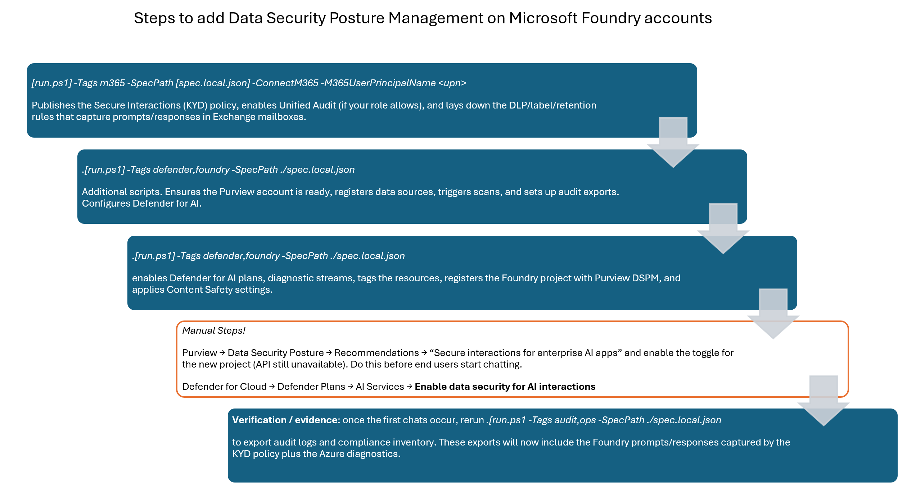
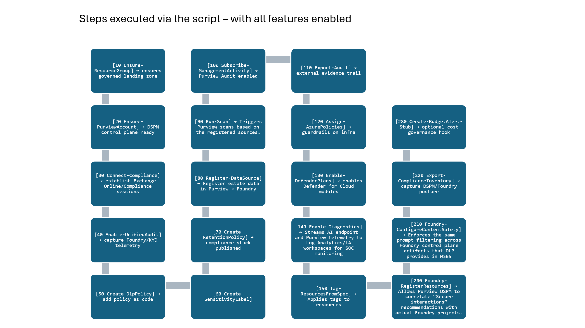

# AI Governance and Security Accelerator

This accelerator automates the deployment and configuration of **Microsoft Purview Data Security Posture Management (DSPM) for AI**, eliminating manual setup steps and providing a documented, repeatable process to govern AI workloads across your tenant. By running spec-driven PowerShell modules, you can rapidly enable DSPM for AI features that discover, classify, and protect data used by **Azure AI Foundry**, **ChatGPT Enterprise**, **Microsoft 365 Copilot**, and **Microsoft Fabric**—ensuring every AI interaction inherits enterprise-grade security and compliance controls.

The solution delivers:

- **Automated DSPM for AI enablement** – turn on Purview's AI-specific recommendations, sensitivity labeling, DLP policies, and audit capture without manual portal clicks.
- **Microsoft Foundry control plane governance** – apply Azure Policies, Content Safety guardrails, resource tagging, and Defender for AI telemetry to every Foundry project and connection.
- **Microsoft Fabric discovery and protection** – register OneLake roots, Lakehouse tables, and Fabric workspaces in Purview DSPM so AI models trained on Fabric data remain continuously monitored and classified.
- **End-to-end auditability** – export interaction logs, compliance inventory, and posture evidence to storage or Fabric for downstream analytics and regulatory reporting.

All automation is spec-driven: copy the shared template (`spec.dspm.template.json`) to an environment-specific file (for example `spec.local.json`) that feeds the PowerShell modules configuring resources, enabling compliance controls, and collecting telemetry across tenants. This approach replaces error-prone manual workflows with versioned policy/configuration-as-code, accelerating time-to-compliance and ensuring consistent DSPM coverage as new AI services and Fabric environments are onboarded.


---

## Architecture
```
                      +----------------------------------------------+
                      |          Microsoft Entra Tenant Boundary      |
                      |                                              |
                      |  +------------------+        +-------------+ |
                      |  |  Microsoft 365   |        |  Fabric /   | |
                      |  |  (Teams, EXO,    |        |  OneLake    | |
                      |  |  SharePoint, etc)|        |  Workspaces | |
                      |  +--------+---------+        +------+------+ |
                      |           |                           |      |
                      |           | Unified Audit / KYD        |      |
                      |           v                           v      |
                      |  +------------------+       +---------------+ |
                      |  |  Purview DSPM    |<----->| Defender for  | |
                      |  |  (Spec-driven    |  Alerts| AI / Defender| |
                      |  |  policies, scans)|       | for Cloud     | |
                      |  +----+------+------+       +-------+-------+ |
                      |       ^      ^                      |         |
                      |       |      |                      |         |
                      |  DLP /|      |Scan metadata         |Diag +   |
                      |  Retention   |                      |signals   |
                      |       |      |                      v         |
                      |  +----+------+-----+      +------------------+|
                      |  |   Azure AI       |<---->|  Log Analytics   ||
                      |  |   Foundry        |  Diag|  Workspace       ||
                      |  | (projects,       |  data|  (Sentinel/SOC)  ||
                      |  |  Content Safety) |      +------------------+|
                      |  +---------+--------+               ^          |
                      |            |                        |          |
                      |            |Secure Interactions     |Evidence   |
                      |            v                        |Exports    |
                      |       +----+-----+                  |          |
                      |       |  Users & |<-----------------+          |
                      |       |  AI Apps |  Prompts/Results            |
                      |       +----------+                             |
                      +----------------------------------------------+
```

## Interaction callouts
- **Secure interactions (KYD)**: M365 sends Foundry prompts/responses to Purview DSPM via Unified Audit, landing in user mailboxes for retention/eDiscovery.
- **Purview ↔ Defender for AI**: DSPM recommendations illuminate Defender posture; Defender for AI sends detections back to Purview activity explorer.
- **Foundry ↔ Log Analytics**: `07-Enable-Diagnostics.ps1` streams diagnostic logs from Cognitive Services/Foundry to Log Analytics, powering Defender analytics and SOC hunting.
- **Fabric/OneLake ↔ Purview**: Registration/scans keep Fabric datasets classified so downstream Foundry agents respect sensitivity labels.
- **Evidence exports**: Purview audit exports (Management Activity) and compliance inventory dumps feed Log Analytics or storage for regulators.


## Prerequisites

Before DSPM can provide insights and risk analytics, you must opt in to analytics processing for Insider Risk Management (IRM) and Data Loss Prevention (DLP). This is a prerequisite for DSPM to start scanning and correlating data security signals. Once enabled, DSPM automatically begins scanning your data estate for sensitive data and risky activities.
- **PowerShell 7 required** – run every script (including `run.ps1`) from pwsh 7.x to avoid Windows PowerShell module loader conflicts.
- **Az module installed** – install or update the Az rollup before running anything:

  ```powershell
  pwsh
  Install-Module Az -Scope CurrentUser -Force
  Install-Module Az.Security -Scope CurrentUser -Force    # defender steps
  ```

- **Microsoft 365 E5** (or **E5 compliance**) license assigned to an operator with **Compliance Administrator** and **Purview Data Source Administrator rights** ([Microsoft Learn](https://learn.microsoft.com/en-us/purview/ai-microsoft-purview-considerations#prerequisites-for-data-security-posture-management-for-ai)).
- **Exchange Online Management module** installed on a workstation capable of satisfying MFA for audit enablement steps ([Connect to Exchange Online PowerShell](https://learn.microsoft.com/en-us/powershell/exchange/connect-to-exchange-online-powershell)).
- The **operator** running the Microsoft 365 tag (`run.ps1 -Tags m365`) must hold **Unified Audit** roles (Compliance Administrator, Organization Management, or Audit Admin). Without those permissions Exchange will report "completed successfully but no settings modified" when toggling `Set-AdminAuditLogConfig`, so the scripts emit a warning and you must enable unified audit in the Purview/M365 Compliance portal instead.
- Run the Exchange Online steps (`run.ps1 -Tags m365`) from that workstation; containerized environments without a browser should execute the remaining tags (`dspm`, `defender`, `foundry`) separately. If you're staying on the desktop, you can combine everything in one go ([Modern auth with MFA guidance](https://learn.microsoft.com/en-us/powershell/exchange/connect-to-exo-powershell#connect-to-exchange-online-powershell-using-modern-authentication-with-or-without-mfa)):
  ```powershell
  ./run.ps1 -Tags m365,dspm,defender,foundry -SpecPath ./spec.local.json
  # or, from bash/zsh: pwsh ./run.ps1 -Tags m365,dspm,defender,foundry -SpecPath ./spec.local.json
  ```
- Azure RBAC permissions: **Contributor** on the subscription that hosts Purview, AI Foundry, and Defender resources.

---


## Quick start

1. **Install the tooling** – open PowerShell 7 and install/refresh the Az bits you need:
   ```powershell
   Install-Module Az -Scope CurrentUser -Repository PSGallery -Force -AllowClobber
   Install-Module Az.Security -Scope CurrentUser -Force
   ```
2. **Sign in to Azure** – authenticate in the same shell that will run the scripts:
   ```powershell
   Connect-AzAccount -Tenant '<tenant-guid>' -Subscription '<subscription-guid>'
   ```
   For automation, use a service principal or managed identity instead (device-code auth is disabled here):
   ```powershell
   Connect-AzAccount -ServicePrincipal -Tenant '<tenant-guid>' -ApplicationId '<appId>' -Credential (Get-Credential)
   ```
3. **Prepare the spec** – this is an optional step and should only be run in a new clone before running scripts. As the solution grows additional parameters may be added, or refactored. Regenerate the public template when the schema changes, then clone it to your local copy:
   ```powershell
   pwsh ./scripts/governance/00-New-DspmSpec.ps1 -OutFile ./spec.dspm.template.json
   Copy-Item ./spec.dspm.template.json ./spec.local.json
   ```
   Populate tenant/subscription IDs, Purview settings, Foundry resources, Content Safety endpoints, etc., and keep the local file untracked.
4. **Execute the modules** – from the repo root, run the individual scripts you need (or orchestrate them via tags as in the examples). A typical first run looks like:
   - **Foundation (Purview landing zone):**
     ```powershell
     pwsh ./scripts/governance/01-Ensure-ResourceGroup.ps1 -SpecPath ./spec.local.json
     pwsh ./scripts/governance/dspmPurview/02-Ensure-PurviewAccount.ps1 -SpecPath ./spec.local.json
     ```
   - **Microsoft 365 compliance  (desktop + MFA):**
     ```powershell
     ./run.ps1 -Tags m365 -SpecPath ./spec.local.json
     # bash/zsh: pwsh ./run.ps1 -Tags m365 -SpecPath ./spec.local.json
     ```
     Connects to Exchange Online, ensures Unified Audit, and publishes KYD/DLP/label/retention settings.
   - **Purview registrations and scans:**
     ```powershell
     pwsh ./scripts/governance/dspmPurview/03-Register-DataSource.ps1 -SpecPath ./spec.local.json
     pwsh ./scripts/governance/dspmPurview/04-Run-Scan.ps1 -SpecPath ./spec.local.json
     ```
   - **Defender for AI posture:** - additional manual step necessary
     ```powershell
     pwsh ./scripts/defender/defenderForAI/06-Enable-DefenderPlans.ps1 -SpecPath ./spec.local.json
     pwsh ./scripts/defender/defenderForAI/07-Enable-Diagnostics.ps1 -SpecPath ./spec.local.json
     ```
   - **Foundry registration + Content Safety:** - need content safety endpoint in the parameter file
     ```powershell
     pwsh ./scripts/governance/dspmPurview/30-Foundry-RegisterResources.ps1 -SpecPath ./spec.local.json
     pwsh ./scripts/governance/dspmPurview/31-Foundry-ConfigureContentSafety.ps1 -SpecPath ./spec.local.json
     ```
   - **Optional orchestrator:** bundle the same steps with tags instead of individual scripts:
     ```powershell
     ./run.ps1 -Tags m365 -SpecPath ./spec.local.json
     ./run.ps1 -Tags dspm,defender,foundry -SpecPath ./spec.local.json
     ./run.ps1 -Tags all -SpecPath ./spec.local.json
     ```
     Mix tags however you like (for example `-Tags foundation,dspm`).
5. **Review dashboards & export evidence** – once telemetry and policies show up, capture artifacts:
   ```powershell
   pwsh ./scripts/governance/dspmPurview/17-Export-ComplianceInventory.ps1 -SpecPath ./spec.local.json
   pwsh ./scripts/governance/dspmPurview/21-Export-Audit.ps1 -SpecPath ./spec.local.json
   ```

### Defender for Cloud plan choices

Populate `defenderForAI.enableDefenderForCloudPlans` (in `spec.dspm.template.json` or your local copy) with every Defender for Cloud plan you want the automation to enable before Defender for AI configuration/activation scripts run. Common values include:

- `CognitiveServices` (displayed as **AI Services** in the Defender for Cloud portal) – protection for Azure AI Foundry, Azure OpenAI, and other Cognitive Services resources that handle prompts, responses, or model orchestration. **Note:** enabling the "Enable data security for AI interactions" feature for AI Services in Defender still requires a manual step in the Purview portal (see the manual checkpoints section below). 
- `Storage` – coverage for Storage accounts holding prompt transcripts, audit exports, embeddings, or fine-tuning payloads.
- `Containers` – Defender for Containers for AKS/Fabric scenarios where containerized agents run inference pipelines.
- `KeyVaults` – detection around vaults storing model keys, Content Safety secrets, or managed identities.
- `AppServices` and `Api` – surface exploits or drift on App Service / API Management front ends used by prompt flow apps.
- `ContainerRegistry` – protect custom model images prior to deployment.
- `KubernetesService` and `VirtualMachines` – telemetry from GPU clusters or VM pools hosting self-managed inference.
- `ResourceManager` (a.k.a. `Arm`) – watch for control-plane changes that might weaken AI guardrails.
- `SqlServers`, `SqlServersOnVirtualMachines`, `OpenSourceRelationalDatabases`, `CosmosDbs` – when AI workloads persist chat history, embeddings, or feature stores in those data services.
- `ContainerApp` and `Dns` – helpful when exposing AI agents through Container Apps or public endpoints.

Add or remove plan strings as needed; the `06-Enable-DefenderPlans.ps1` module iterates the array and skips any plan already turned on in the subscription.

**Know Your Data capture (KYD):** run `./run.ps1 -Tags m365 -SpecPath ./spec.local.json` from a local PowerShell 7 session whenever you need to (re)enable Unified Audit, create the Secure interactions/KYD policy, or publish the DLP/label/retention settings baked into your spec. The script loads the Exchange Online Management module, prompts for MFA in your default browser, and creates the policy that stores prompts/responses in each user’s mailbox so the data inherits retention, eDiscovery, and Communication Compliance. See `docs/dspm-sales-narrative.md` (steps 2–3) and the Microsoft Learn article on [turning auditing on or off](https://learn.microsoft.com/en-us/purview/audit-log-enable-disable) for the exact operator walkthrough and objection handling.

**Why the registration script matters:** `30-Foundry-RegisterResources.ps1` leverages the `aiFoundry` and `foundry.resources[]` sections in `spec.local.json`, validates each resource, and writes the metadata Purview’s DSPM blades use to associate Azure AI Foundry projects with your broader AI estate. Without that registration pass, Defender for Cloud may still discover the workspace, but Purview cannot correlate the DSPM recommendation state or surface “Secure interactions for enterprise AI apps” for that project, which is why rerunning the script keeps recommendations aligned with the rest of your environment.

**Content Safety script behavior:** if `foundry.contentSafety` is missing, the script logs "No foundry.contentSafety" and skips configuration so the rest of the tag run continues. When an endpoint is present but the Key Vault secret info is omitted or local auth is disabled, the script automatically requests an Entra ID access token for `https://cognitiveservices.azure.com` (works with system-assigned managed identities) and uses it to call the Content Safety REST APIs. Supplying a Key Vault secret still works when you prefer key-based auth. In either mode, every Foundry project listed under `foundry.resources` inherits the blocklists/items defined in the spec.

---

## Lower effort to enable

1. **Author the spec** – capture tenant, subscriptions, Purview account, Azure AI assets, data sources, and compliance intent in your local copy (for example `spec.local.json`).
2. **Run atomic modules** – invoke only the scripts you need (or call `run.ps1` with tags) to ensure prerequisites, enable compliance services, create policies, and register data sources.
3. **Validate posture** – use the verification modules to confirm Defender plans, audit ingestion, and Purview policy status, then hand the spec to ops for day-two governance.

---

## Capabilities at a glance

- **Purview Data Security Posture Management (DSPM) for AI**: register storage, SQL, OneLake, and Fabric workspaces, trigger Purview DSPM for AI scans, and apply sensitivity labels, DLP policies, and retention rules so AI workloads (Azure AI Foundry and ChatGPT Enterprise) inherit Microsoft Purview’s DSPM controls.
- **Security posture**: assign Azure Policies, enable Defender for Cloud plans, and ship diagnostics to Log Analytics for continuous monitoring of AI endpoints.
- **Compliance evidence**: subscribe to the Management Activity API, export audit logs, and push transcripts into storage or Fabric for downstream analytics.
- **Application guardrails**: configure Content Safety blocklists, tag Azure resources with compliance metadata, and lay the groundwork for AI prompt filtering in ChatGPT Enterprise.

## DSPM for AI & Defender for AI — Features and Benefits Mapping

| **Environment Component**                                      | **Secured Asset (What It Protects)**                                                     | **Product**                                                 | **Key Features**                                                                                                                                                      | **Business Benefits**                                                                                                          |
| -------------------------------------------------------------- | ---------------------------------------------------------------------------------------- | ----------------------------------------------------------- | --------------------------------------------------------------------------------------------------------------------------------------------------------------------- | ------------------------------------------------------------------------------------------------------------------------------ |
| **Azure AI Foundry**                                           | AI interactions (prompts & responses), workspaces, connections to data sources           | Microsoft Purview **DSPM for AI**                           | Centralized discovery of AI interactions; sensitivity classification & labeling; DLP on prompts/responses; audit & eDiscovery integration                             | Prevents sensitive-data leakage via AI; enforces consistent data handling; accelerates investigations and compliance reporting |
| **Azure OpenAI / Azure ML (AI runtime)**                       | Model endpoints, prompt flow apps, deployments, keys/secrets linkage                     | **Defender for AI**                                         | AI-specific threat detection and posture hardening; misconfiguration findings; attack-path/context analysis for AI components                                         | Reduces breach risk and configuration drift; shortens time-to-detect and time-to-remediate for AI workloads                    |
| **Microsoft Fabric OneLake**                                   | Tables/files (Delta/Parquet), Lakehouse/Warehouse data, Domains                          | Microsoft Purview (Info Protection + DLP) & **DSPM for AI** | Sensitivity labels; **DLP for structured data in OneLake**; label coverage goals & reports; activity monitoring                                                       | Enforces least-privilege & prevents oversharing; provides measurable posture improvements and evidence for audits              |
| **Fabric Workspaces & Items**                                  | Workspaces, Dataflows, Datasets, Notebooks, Pipelines                                    | Fabric native RBAC + Microsoft Purview integrations         | Workspace/item security; default label per domain; end-to-end auditability with Purview; federated governance between **OneLake Catalog** and Purview Unified Catalog | Consistent guardrails for self-service analytics; clear ownership; end-to-end traceability for regulated data operations       |
| **Fabric AI Experiences (e.g., Copilot in Fabric)**            | AI-generated insights & Q&A over governed data                                           | Microsoft Purview **DSPM for AI**                           | Oversharing prevention in AI experiences; policy evaluation before/around AI actions; audit of interaction data                                                       | Safe, governed self-service AI analytics without exposing sensitive data; audit-ready usage trails                             |
| **Cross‑estate AI Interactions (enterprise AI apps & agents)** | Prompt/response interaction data spanning Copilot, custom agents, and registered AI apps | Microsoft Purview **DSPM for AI**                           | Unified view of where AI interactions occur; policy enforcement across multiple AI entry points; natural-language risk exploration                                    | Single control plane for AI data risks; consistent compliance across heterogeneous AI surfaces                                 |

---


### DSPM for Microsoft Foundry Steps

The following diagram illustrates the end-to-end automation flow for securing Azure AI Foundry with Purview DSPM and Defender for AI:




Manual steps exist where Microsoft has not yet exposed APIs or where MFA-capable desktop sessions are mandatory (Exchange Online, Purview preview toggles). Keep this diagram handy when planning customer demos so you can assign owners before the run.

### DSPM for M365 Copilot, Microsoft Foundry, custom AI solutions and ChatGPT Enterprise



### Required manual checkpoints

1. **Secure interactions / KYD policy (Purview portal)**
  - Navigate to **https://web.purview.azure.com** → **Data Security Posture MAnagement for AI** → **Recommendations** → **Secure interactions for enterprise AI apps**. Be sure it is enabled

2. **Exchange Online desktop session for `m365` tag (desktop required, not containers/Codespaces)**
  - Open PowerShell 7 on a workstation with browser-based MFA, install/update the Exchange Online Management module, and run `./run.ps1 -Tags m365 -ConnectM365 -M365UserPrincipalName <upn>`.
  - Approve the MFA prompts, confirm Unified Audit reports “Enabled,” and verify the Secure interactions (KYD) policy appears under **Data lifecycle management** in the Purview portal.
3. **Communication Compliance / Insider Risk previews**
  - In the Microsoft Purview compliance portal, browse to **Communication Compliance** and **Insider Risk Management** to enable any required preview policies or monitoring templates (for example sensitive keywords, channel monitoring, or policy templates tied to AI prompts).
  - Document approvals with screenshots or exports; these features remain portal-only.
4. **Post-run review and evidence capture**
  - Check Defender for Cloud, Purview DSPM dashboards, and Azure Policy compliance to ensure new registrations/scans are reflected.
  - Run `17-Export-ComplianceInventory.ps1` / `21-Export-Audit.ps1` only after confirming telemetry is flowing, then upload the artifacts to your evidence repository (SharePoint, Fabric, or storage account) for audit traceability.
  - If Fabric scans are enabled later, confirm in the Purview portal that the scan job completed successfully; rerun manually when changes occur.

Use this checklist with your stakeholders to understand which steps require human interaction and which ones the automation handles.

### Tag reference

| Tag                                                                         | What it runs / why it exists                                                                                                                                                                                                                                                                                  | Example command |
| --------------------------------------------------------------------------- | ------------------------------------------------------------------------------------------------------------------------------------------------------------------------------------------------------------------------------------------------------------------------------------------------------------- | ---------------- |
| `foundation`                                                                | Baseline Purview/DSPM bootstrap: `01-Ensure-ResourceGroup.ps1`, `02-Ensure-PurviewAccount.ps1`, data-source registration + first scans. Delivers the landing zone Purview needs before policies or scans proceed.                                                                                             | `./run.ps1 -Tags foundation -SpecPath ./spec.local.json` |
| `m365`                                                                      | Exchange Online / Compliance Center steps that require interactive auth: connect session, enable Unified Audit, create the Know Your Data (Secure interactions) policy, and publish the DLP/label/retention settings from your spec. Run from a desktop with MFA access (see `docs/dspm-sales-narrative.md`). | `./run.ps1 -Tags m365 -SpecPath ./spec.local.json` |
| `dspm`                                                                      | Broader Purview governance tasks beyond the bootstrap: scan registration, audit subscriptions/exports (`20-21`), Azure policy assignments, tagging, posture validation. Combine with `foundation` for the full Purview story.                                                                                 | `./run.ps1 -Tags foundation,dspm -SpecPath ./spec.local.json` |
| `defender`                                                                  | Defender for AI enablement scripts (`06-Enable-DefenderPlans.ps1`, `07-Enable-Diagnostics.ps1`) plus content-safety wiring. Requires the AI subscription/resource group fields in the spec.                                                                                                                   | `./run.ps1 -Tags defender -SpecPath ./spec.local.json` |
| `foundry`                                                                   | Azure AI Foundry integration: resource registration, tagging, diagnostics, content safety, OneLake/Fabric registration (when enabled). Works off `aiFoundry` and `foundry.resources` blocks in the spec.                                                                                                      | `./run.ps1 -Tags foundry -SpecPath ./spec.local.json` |
| `scans`, `audit`, `policies`, `diagnostics`, `ops`, `tags`, `contentsafety` | Finer-grained switches used internally by the plan. You usually won’t call them directly unless you want to rerun a single atomic step (e.g., `-Tags audit` to replay the audit export scripts).                                                                                                         | `./run.ps1 -Tags audit -SpecPath ./spec.local.json` |
| `all`                                                                       | Convenience alias that expands to every tag listed above (runs everything end-to-end).                                                                                                                                                                                                                        | `./run.ps1 -Tags all -SpecPath ./spec.local.json` |

Use whichever combination suits your workflow (for example, `-Tags m365` from a workstation, then `-Tags dspm,defender,foundry` from Cloud Shell). Documenting the tags keeps the intent clear until we refactor or rename them.

## Run plan breakdown

`run.ps1` drives a fixed plan (see `$plan` in the script) so every atomic step of DSPM for AI and the Foundry control plane happens in a deterministic order. The table below expands each step, explaining both *what* the script does and *why* it matters.

| Order | Script | What happens | Why it matters for DSPM / Foundry |
| ----- | ------ | ------------- | --------------------------------- |
| 5 | `00-New-DspmSpec.ps1` | Generates or refreshes the spec contract (`spec.dspm.template.json`) and, by default, writes it to `-SpecPath`. | Keeps every run tied to a declared configuration so compliance/policy intent stays versioned and auditable. |
| 10 | `01-Ensure-ResourceGroup.ps1` | Confirms or creates the landing-zone resource group for Purview, Defender, diagnostics, and Foundry resources. | Guarantees there is a governed container before policies, RBAC, and diagnostics are layered on top. |
| 20 | `02-Ensure-PurviewAccount.ps1` | Ensures the Purview account exists and is configured per spec. | DSPM analytics, scans, and Secure interactions all depend on a healthy Purview account. |
| 30 | `10-Connect-Compliance.ps1` | Establishes the Exchange Online/Security & Compliance sessions. | Required to publish KYD, DLP, and retention artifacts that capture Foundry prompts/responses. |
| 40 | `11-Enable-UnifiedAudit.ps1` | Turns on Unified Audit (or verifies it). | Without Unified Audit the KYD policy cannot store interactions, so Purview/Defender lose lineage for Foundry chats. |
| 50 | `12-Create-DlpPolicy.ps1` | Creates or updates DLP/KYD policies from the spec. | Enforces the “Secure interactions for enterprise AI apps” control and routes Foundry prompts into governed mailboxes. |
| 60 | `13-Create-SensitivityLabel.ps1` | Publishes sensitivity labels referenced elsewhere in the spec. | Ensures scans and Foundry outputs inherit the right classification vocabulary. |
| 70 | `14-Create-RetentionPolicy.ps1` | Creates retention policies/rules for AI interaction data. | Keeps Foundry transcripts, audit exports, and downstream evidence governed for the required duration. |
| 80 | `03-Register-DataSource.ps1` | Registers data sources (storage, SQL, OneLake, Fabric) in Purview. | Gives DSPM observability across the data estate, including stores that power Foundry projects. |
| 90 | `04-Run-Scan.ps1` | Triggers Purview scans based on the registered sources. | Produces the sensitive-data findings that DSPM uses to prioritize recommendations tied to Foundry workloads. |
| 100 | `20-Subscribe-ManagementActivity.ps1` | Sets up Management Activity / audit exports. | Ships Purview audit telemetry so prompts, scans, and alerts can be reconstructed outside the tenant. |
| 110 | `21-Export-Audit.ps1` | Executes the actual audit export to storage/Fabric. | Creates external evidence proving Foundry prompts and policy actions were recorded. |
| 120 | `05-Assign-AzurePolicies.ps1` | Applies Azure Policy assignments from the spec. | Enforces guardrails (diagnostics, tags, encryption) on Purview and Foundry resources at scale. |
| 130 | `06-Enable-DefenderPlans.ps1` | Enables Defender for Cloud plans tied to AI/Fabric resources. | Lights up Defender for AI detections so Foundry projects inherit threat protection. |
| 140 | `07-Enable-Diagnostics.ps1` | Configures diagnostic settings/log pipelines. | Streams AI endpoint and Purview telemetry to Log Analytics/LA workspaces for SOC monitoring. |
| 150 | `25-Tag-ResourcesFromSpec.ps1` | Applies governance tags described in the spec. | Builds lineage between Azure resources and Purview/Foundry controls, making DSPM reports actionable. |
| 200 | `30-Foundry-RegisterResources.ps1` | Registers Foundry workspaces/projects in Purview DSPM. | Allows Purview DSPM to correlate “Secure interactions” recommendations with actual Foundry projects. |
| 210 | `31-Foundry-ConfigureContentSafety.ps1` | Deploys Content Safety blocklists/settings to Foundry projects. | Enforces the same prompt filtering across Foundry control plane artifacts that DLP provides in M365. |
| 220 | `17-Export-ComplianceInventory.ps1` | Captures compliance inventory outputs. | Produces a bundle of “day zero” evidence for auditors (labels, policies, scans) tied to Foundry. |
| 280 | `24-Create-BudgetAlert-Stub.ps1` | Placeholder for budget alerts. | Allows you to wire cost controls into the same run once your organization finalizes thresholds. |

> Fabric/OneLake scripts (`26-29`) remain commented out in the plan. Once those resources are onboarded, re-enable them so Fabric data surfaces alongside Foundry telemetry in DSPM.

## Spec management

- The repo tracks a sanitized contract in `spec.dspm.template.json`. Update it when the schema evolves so customers always have an authoritative sample.
- Create your working copy via `Copy-Item ./spec.dspm.template.json ./spec.local.json` (or the equivalent). This file is listed in `.gitignore` so it stays on your machine.
- Pass `-SpecPath ./spec.local.json` (or any other filename you choose) when running modules. `run.ps1` defaults to `./spec.local.json` and prints a friendly error if the file is missing.
- For multiple environments, create additional local files such as `spec.dev.json` and point `run.ps1 -SpecPath` to the one you need. Keep secrets in Key Vault rather than the spec.
- Fabric + OneLake placeholders live under `fabric.oneLakeRoots[]` and `fabric.workspaces[]`. Scripts `26-29` in `run.ps1` are commented out until they can gracefully ignore empty arrays, so populate these blocks now and uncomment the lines when you are ready to register/scan Fabric resources.
- Need to postpone an Azure Policy assignment? Set `"enabled": false` on that entry in `azurePolicies`. The assignment script logs the skip and leaves the declaration in place for later.
- Want a field-by-field explanation? See `docs/spec-local-reference.md` for the table that maps each spec parameter to the scripts that consume it.
- Know Your Data evidence flow is fully spec-driven: the `dlpPolicy`, `labels`, and `retentionPolicies` blocks define what the `m365` tag publishes, while `activityExport` controls the Management Activity/Audit offload that keeps KYD prompts and alerting in sync. Pair this README with `docs/dspm-sales-narrative.md` to brief operators on the why/how.

---

## Component guides

- `scripts/governance/README.md` – Microsoft Purview DSPM automation cookbook (policies, scans, audit exports, Foundry integrations).
- `scripts/defender/README.md` – Defender for AI enablement and diagnostics.
- `docs/dspm-sales-narrative.md` – business outcome framing for stakeholders.
- `docs/payGo.md` – optional PAYG cost considerations.

---

## Architecture overview


---

## Script families

| Folder                           | Purpose                                                                                         | Highlights                                                                                                           |
| -------------------------------- | ----------------------------------------------------------------------------------------------- | -------------------------------------------------------------------------------------------------------------------- |
| `scripts/governance`             | Spec management, Purview account bootstrap, policy creation, audit exports, Foundry integration | `00-New-DspmSpec.ps1`, `02-Ensure-PurviewAccount.ps1`, `12-Create-DlpPolicy.ps1`, `30-Foundry-RegisterResources.ps1` |
| `scripts/defender/defenderForAI` | Enable Defender for Cloud AI plans, diagnostics, and integrations                               | `06-Enable-DefenderPlans.ps1`, `07-Enable-Diagnostics.ps1`                                                           |
| `scripts/exchangeOnline`         | Security and Compliance PowerShell prerequisites (behind the `m365` tag)                        | `10-Connect-Compliance.ps1`, `11-Enable-UnifiedAudit.ps1`                                                            |

Each script is idempotent and checks for prerequisites before applying changes. Combine them in CI, during `azd up`, or as one-off remediation tools.

---

## Post provisioning

**Manual Purview action (until API support ships):** after `30-Foundry-RegisterResources.ps1` and `31-Foundry-ConfigureContentSafety.ps1` finish, sign into the Purview portal and navigate to **Data Security Posture > Recommendations > Secure interactions for enterprise AI apps** (a.k.a. **Capture interactions for enterprise AI apps**). Enable the recommendation once and Purview automatically applies it to every Azure AI Foundry account/project as those resources appear. The "Enable Data Security for AI Interactions" switch cannot be set via API yet, so this manual step is required to collect Foundry chat interactions (see [Use Microsoft Purview to manage data security & compliance for Microsoft Foundry](https://learn.microsoft.com/en-us/purview/ai-azure-foundry#getting-started-recommended-steps)).

---

## Next steps

1. Populate `spec.dspm.template.json` as the customer-facing contract and keep per-environment copies such as `spec.local.json` out of source control (store secrets in Key Vault).
2. Wire the atomic modules into your CI/CD or Azure Developer CLI pipeline by calling `run.ps1` with the appropriate tags.
3. Extend the stubs (`15-Create-SensitiveInfoType-Stub.ps1`, `23-Ship-AuditToFabricLakehouse-Stub.ps1`, `32-Foundry-GenerateBindings-Stub.ps1`) to meet organization-specific requirements.

With the spec as the contract, the accelerator keeps Microsoft 365 compliance, Defender telemetry, and Azure AI workloads aligned so AI apps stay governed from prompt to production.


